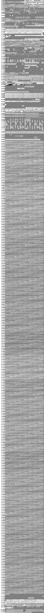

# Unison

**Unison** is a pan-Unicode hybrid bitmap monospace font in development.

* [Glyph samples](https://lifthrasiir.github.io/unison/sample.html)
* [Live sample](https://lifthrasiir.github.io/unison/live.html)

## Pan-What?

A "pan-Unicode" font covers many, if not all, scripts in the Unicode.
Common pan-Unicode fonts include
[Arial Unicode MS](https://en.wikipedia.org/wiki/Arial_Unicode_MS),
[Code2000](https://en.wikipedia.org/wiki/Code2000),
[GNU Unifont](https://en.wikipedia.org/wiki/GNU_Unifont),
[GNU FreeFont](https://en.wikipedia.org/wiki/GNU_FreeFont),
and most recently, [Noto](https://www.google.com/get/noto/) font family.
Unison is designed to be pan-Unicode too.

Conceptually, Unison shares the same goal as GNU Unifont, a fixed-size bitmap font.
The major differences (and possible advantages) are as follows:

* Unison defines a subpixel shape (hence a "hybrid" bitmap font).

  Many other pan-Unicode fonts are either bitmap-only or outline-only,
  and look not that good when zoomed in (bitmap-only) or zoomed out (outline-only).
  While outline fonts try to solve this problem by (largely manual) hinting,
  it is very hard and expensive.

  In contrast, a single font description in Unison can yield
  both a good bitmap font and a reasonable outline font.
  I believe this is an alternative path worth trying.

* Unison tries to support complex script behaviors.

  GNU Unifont in particular is a collection of fixed bitmaps,
  which is of course vastly insufficient in the actual typography.
  Unison aims to support many complex script behaviors in terms of OpenType.

* Unison is designed to be error-proof.

  Whenever possible, a different character
  (after the [canonical normalization](https://en.wikipedia.org/wiki/Unicode_equivalence#Normal_forms))
  is assigned a slightly different shape.
  This provides a partial solution to problems like
  [IDN homograph attack](https://en.wikipedia.org/wiki/IDN_homograph_attack).

* Unison is designed to be consistent and uniform.

  GNU Unifont is known for the varying degree of character designs
  due to a sheer number of contributors and lax design goals.
  Unison tries to be more consistent and uniform in the design.

* Unison is in the [public domain](font/LICENSE.txt).

  Many free and libre fonts use GNU GPL (with a font embedding exception) or SIL OFL.
  This is partly because outline fonts *are* programs and thus treated as softwares.
  They also clearly deserve the credit and GPL+FE and OFL is a way to ensure that.
  But Unison, being a primarily bitmap font, has less benefits in using such licenses.
  In lieu of this, Unison font data is available for all purposes.
  Note that the *softwares* in `src/` have a different license.

  I originally have made this font out of the necessity
  (a self-contained font for [Angolmois](https://github.com/lifthrasiir/angolmois/)),
  and then for learning the font design and OpenType,
  but I think the font itself may be useful for others.
  Have fun!

## Coverage

For now, please see the bitmap glyph chart below.

